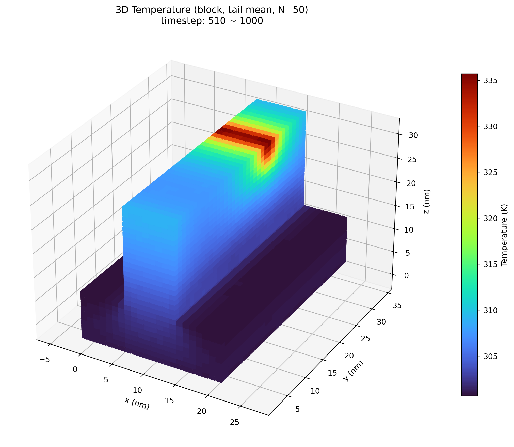

PhonoMC Documentation
=====================

Welcome to the documentation of **PhonoMC**.

Source code repository:
`GitHub <https://github.com/lyushisyan/PhonoMC>`_

PhonoMC is a C++17 phonon Monte Carlo simulator for semiconductor heat
transport. It combines particle transport, real phonon properties from HDF5,
box or surface-mesh geometries, thermal reservoirs, rough and periodic
boundaries, volumetric heat sources, and OpenMP parallelism.

It supports:

- cross-plane and in-plane thermal-conductivity simulations
- STL and OBJ device geometries, including the provided FinFET model
- strict POSCAR and HDF5 material loading
- local or fixed temperature references for energy and lifetime calculations
- uniform and Gaussian volumetric heat sources
- temperature, heat-flux, conductivity, particle-balance, and geometry output
- bundled plotting tools for one-dimensional and three-dimensional results

.. toctree::
   :maxdepth: 1
   :caption: Table of contents
   :numbered:

   introduction
   methodology
   materials
   geometry_boundaries
   requirements
   installation
   starting
   input_files
   tutorial
   results_analysis
   performance
   reference
   troubleshooting
